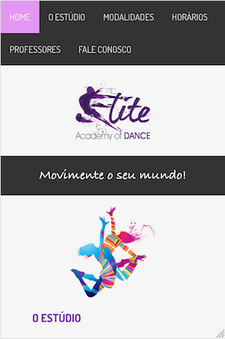
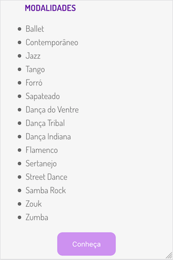
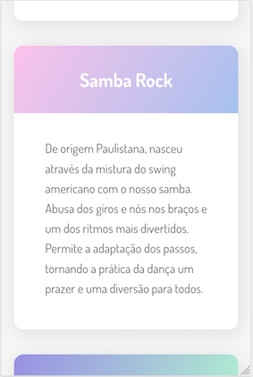

# Website Dance School

This project was created for a dance school website, for study purposes, and is still in development.

I chose develop about dance because it is an art that I like and admire a lot. :dancer:

## Getting Started

These guidelines aims to instruct on how to have the project up and running on your local machine for development and testing purposes.

### Tech Stack

- HTML5
- CSS
- JavaScript

### Development

1. To start the development, it is necessary to clone the GitHub project in a directory of your choice:

    - **SSH**
    ```
    cd "directory of your choice"
    git clone git@github.com:fvv-vasquez/study-website-danceschool.git
    cd study-website-danceschool
    ```

    - **HTML**
    ```
    cd "directory of your choice"
    git clone https://github.com/fvv-vasquez/study-website-danceschool.git
    cd study-website-danceschool
    ```

1. This project use two external APIs, you can download the project here e follow the steps to run:

    ```
    https://github.com/fvv-vasquez/dance-school-backend
    ```

1. Currently, the backend APIs are being executed on port 8080, so if you follow the steps above you can simply open the `index.html` on root folder in the browser and you will see the rendered website. However, in case your backend APIs are hosted in a different port or domain, you can change the following files adjusting the API call URL.

    - Open file `scripts.js`, then update the URL on line 12, this is the place where the GET request is done.
    - Open file `contato.html`, then update the URL on line 42, this is the place where the POST request is done.

## Demo

You can see a demo on YouTube:

[](http://www.youtube.com/watch?v=f3Aqee8Ba1Q "")

## Website screenshots

Some screenshots from the website

- Homepage


- Modalidades


- Fale Conosco


Some screenshots from the website, but in responsive size 320 (mobile)

- Homepage




- Modalidades



- Fale Conosco

